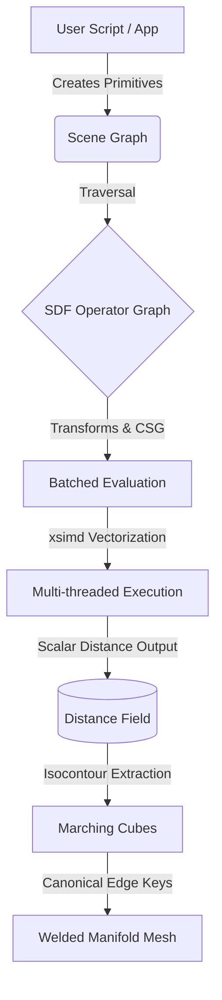

:::caution[API Stability]
The Python API is currently **unstable**. Breaking changes may occur without major version bumps as the kernel evolves.
:::

```mermaid
graph TD
    A[User Script / App] -->|Creates Primitives| B(Scene Graph)
    B -->|Traversal| C{SDF Operator Graph}
    C -->|Transforms & CSG| D[Batched Evaluation]
    D -->|xsimd Vectorization| E[Multi-threaded Execution]
    E -->|Scalar Distance Output| F[(Distance Field)]
    F -->|Isocontour Extraction| G[Marching Cubes]
    G -->|Canonical Edge Keys| H[Welded Manifold Mesh]
```